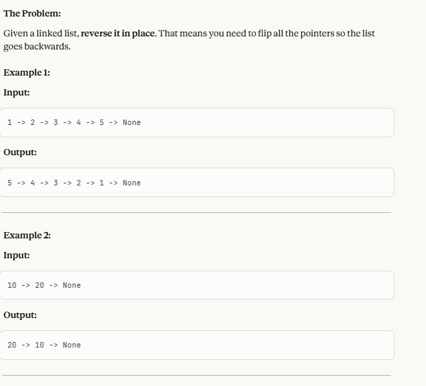

In this project, a linkedList is given and we have been asked to reverse it.

As you see below:

The most important part is to understand the "reverse" as None is real.

And how to reverse the next node to back.

